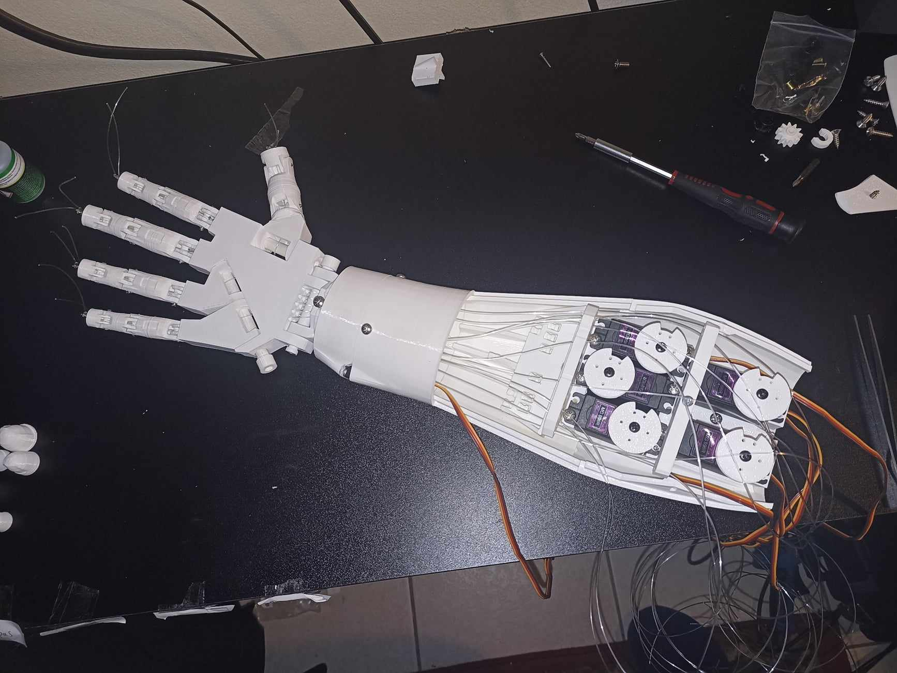
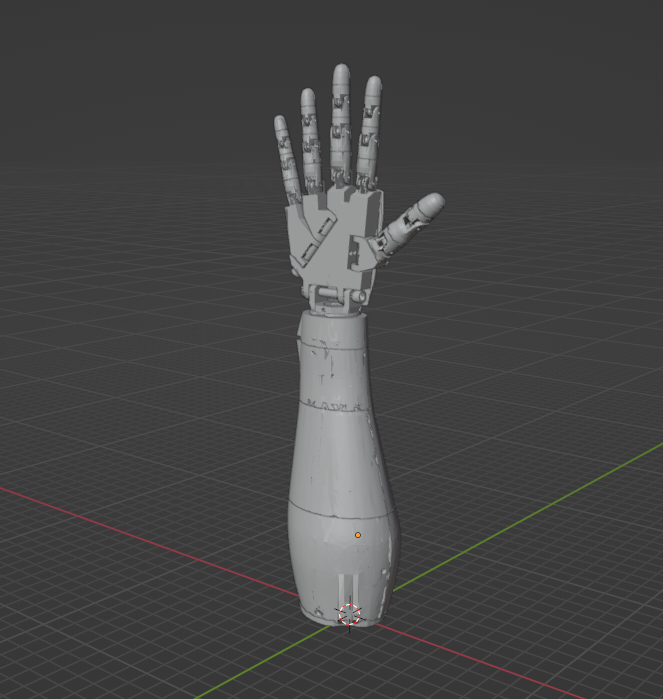
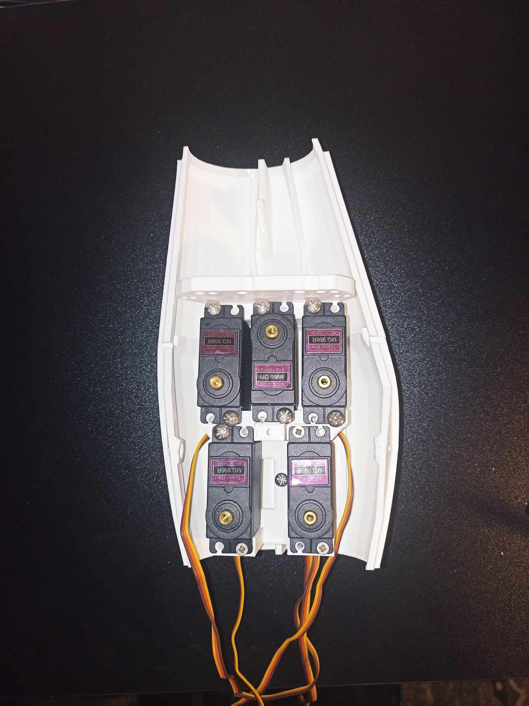
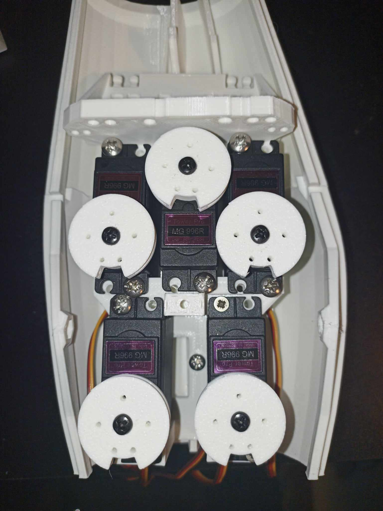
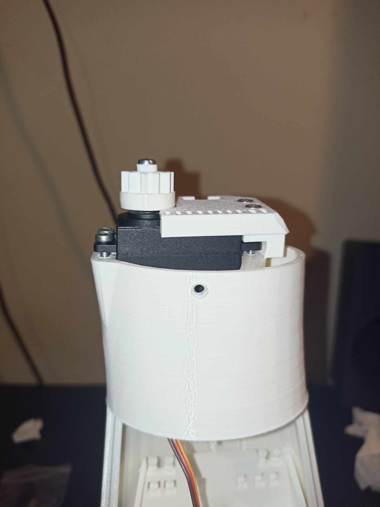
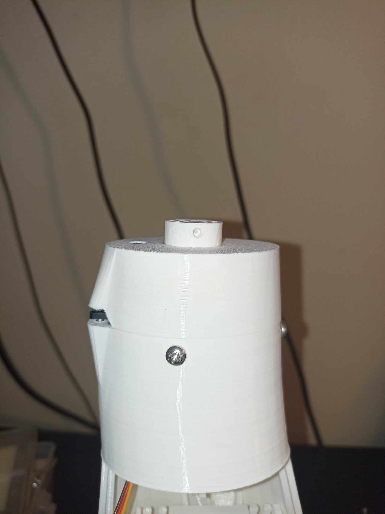
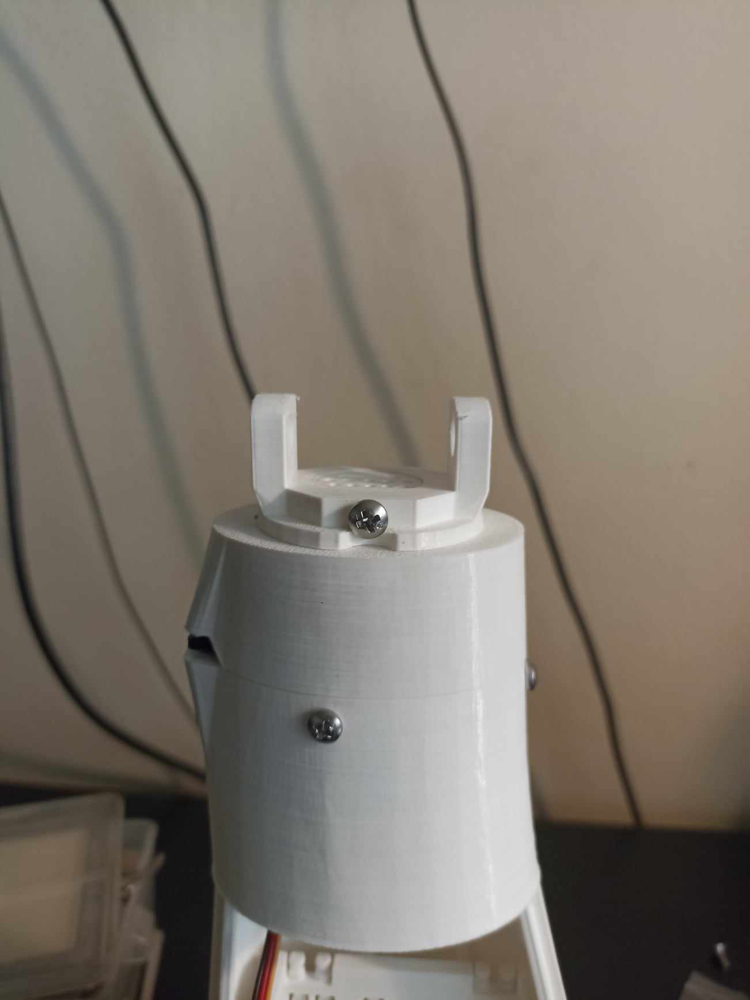
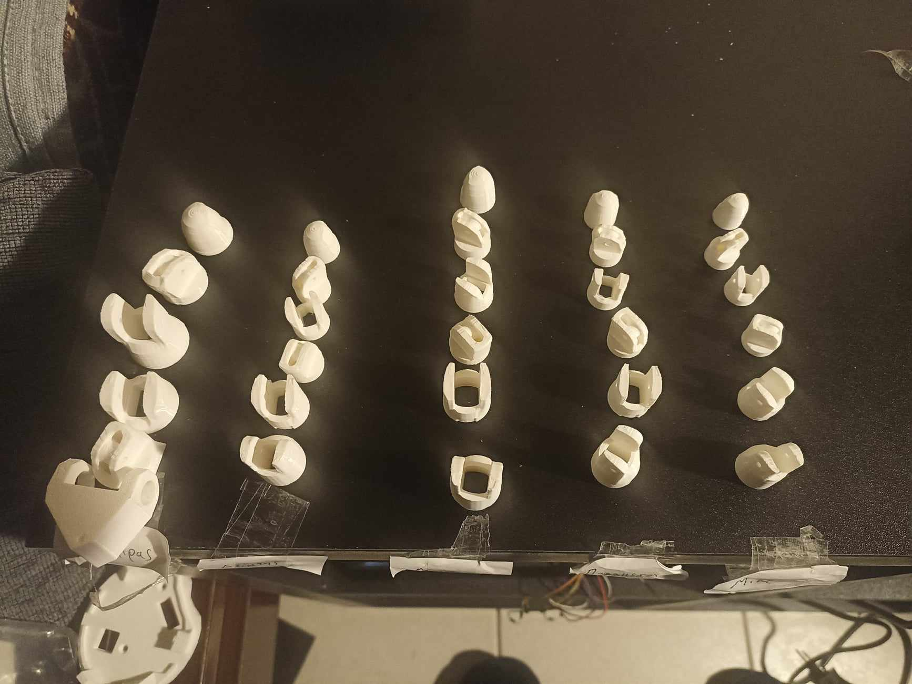
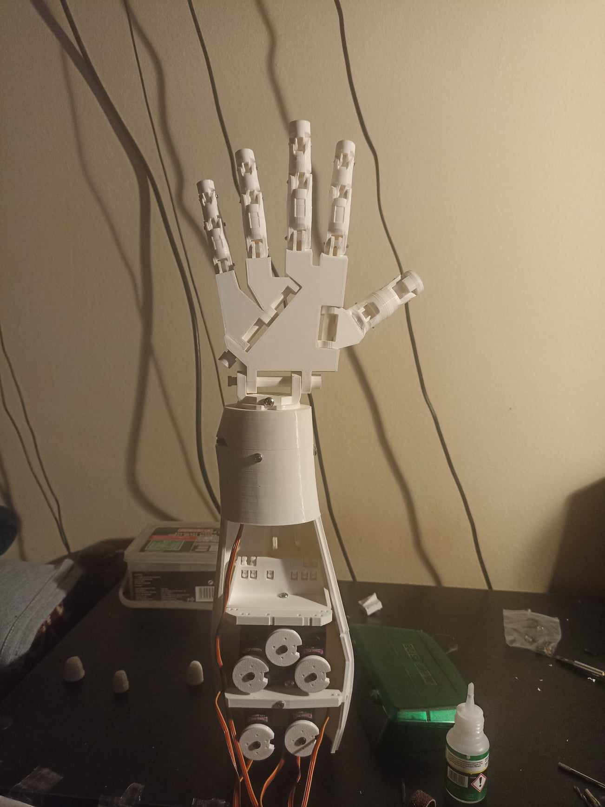
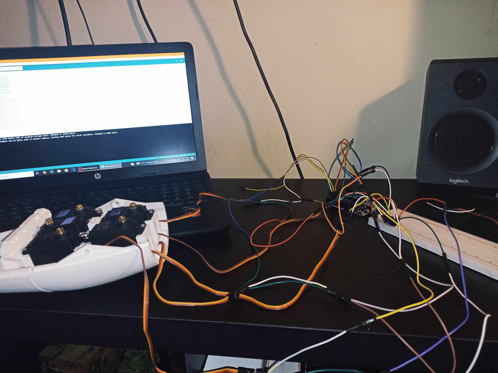

# Integrating Motion: From Human Hand to Robotic Movement

### Bachelor's Thesis

**University of Thessaly**  
School of Technology  
Department of Digital Systems

Design • Robotics • Embedded Systems • 3D Printing

 

---

*Design and implementation of a 3D-printed robotic hand prototype capable of reproducing human hand movements using Arduino and servo motors.*

---

# Table of Contents

- [Overview](#overview)
- [Project Highlights](#project-highlights)
- [Project Objectives](#project-objectives)
- [Technologies](#technologies)
- [Robotic Hand Architecture](#robotic-hand-architecture)
- [Development Process](#development-process)
- [Applications](#applications)
- [Project Gallery](#project-gallery)
- [Thesis](#thesis)
- [Author](#author)
- [License](#license)

---

# Overview

This repository contains my Bachelor's Thesis focused on the design, development, and implementation of a robotic hand capable of reproducing predefined human hand movements.

The project combines mechanical engineering, embedded systems, electronics, and additive manufacturing to demonstrate the complete development process of a functional robotic prototype.

From the initial concept and CAD design to the final assembly, programming, and testing, this project explores the practical application of robotics principles through the construction of a fully operational robotic hand.

  

---

# Project Highlights

- Designed and developed a functional robotic hand prototype
- Manufactured custom components using 3D printing
- Implemented an Arduino Uno embedded control system
- Developed a tendon-driven finger actuation mechanism
- Designed all mechanical parts using Blender
- Demonstrated the complete engineering workflow from concept to prototype

---

# Project Objectives

- Design a functional robotic hand
- Develop a lightweight mechanical structure
- Manufacture custom components using 3D printing
- Implement embedded control using Arduino
- Reproduce human hand movements through servo actuation
- Evaluate the overall performance of the robotic system

---

# Technologies

## Hardware

- Arduino Uno
- MG996R Servo Motors
- PLA 3D Printed Components
- Stainless Steel Support Base
- Tendon-Based Transmission Mechanism
- Mechanical Fasteners

## Software

- Arduino IDE
- C++
- Blender

---

# Robotic Hand Architecture

The robotic hand consists of:

- Forearm
- Wrist
- Five articulated fingers
- Fixed support base

Each finger is independently actuated by an MG996R servo motor through a tendon-driven mechanism, enabling smooth and repeatable movement.

The design focuses on modularity, ease of fabrication, and mechanical simplicity.

---

# Development Process

1. Robotics Research
2. Mechanical Design
3. CAD Modeling
4. Material Selection
5. 3D Printing
6. Mechanical Assembly
7. Electronics Integration
8. Embedded Programming
9. Functional Testing
10. Performance Evaluation

---

# Applications

- Human–Robot Interaction
- Educational Robotics
- Embedded Systems
- Robotic Manipulators
- Prosthetics Research
- Assistive Robotics

---

# Project Gallery

## CAD Design

## Prototype Development

## Final Electronic Circuit

---

# Thesis

The complete Bachelor's Thesis is available in this repository.

**[Read the Thesis](Thesis.pdf)**

---

# Author

**Nikolaos Topis**

Bachelor's Degree in Digital Systems

University of Thessaly

**Supervisor:** Georgios Adam

---

# License

Copyright © Nikolaos Topis. All Rights Reserved.

This repository is published for educational, research, and portfolio purposes.

For complete licensing information, please refer to the **[LICENSE](LICENSE)** file.
